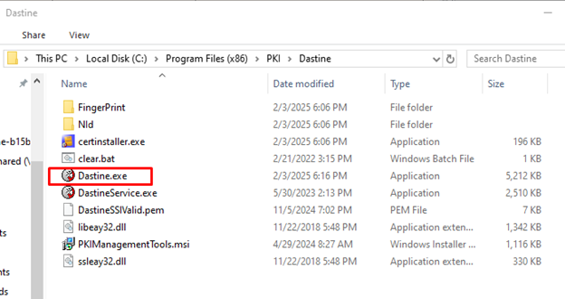
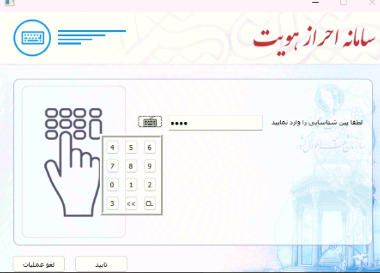

# ID PIN Authentication Process

# **Introduction**

This report outlines the detailed process for ID PIN authentication using Iranian National Identity (NID) card, including the technical procedures involved in card communication and data retrieval. It explains the mechanisms for establishing a connection to the card reader, validating the card using the Answer To Reset (ATR), and obtaining critical card information, including the Card Serial Number (CSN), Card Registration Number (CRN), issuance and expiration dates, and various internal card version details. Furthermore, the report highlights the methods used to retrieve essential authentication data, such as signing and authentication certificates, fingerprint status, and PIN verification status.

Additionally, the report documents the procedure for generating and transmitting a SOAP web request containing encrypted and base64-encoded JSON data to the server endpoint. This request contains detailed card information, including the CSN, CRN, signing certificate, and other authentication parameters. Finally, it describes the PIN verification process, including the handling of various status codes from the card, management of blocked PIN scenarios using a Personal Unblocking Key (PUK), and outlines the subsequent card authentication procedures involving encryption keys, message authentication codes, terminal identification data, and secure session establishment parameters.

# **What is Dastine SDK?**

Dastine SDK contains executable files that are needed for communication with the card to facilitate identity verification. The SDK contains a few executable files. `Dastine.exe` is the client-side EXE file, which will create a window console and wait for user input. This EXE will wait for the user to write commands, such as `GetVersion` or `NIDSign`, which are documented on the Iranian [PKI website](https://dastine.pki.co.ir/doxygen/class_dastine.html). On the PKI website, these commands are class names, but in reality, these are console commands that can be typed in the terminal.



Dastine SDK directory

The SDK location is `C:\Program Files (x86)\PKI\Dastine`, and in the same directory, the EXE file `DastineService.exe` is located. The commands have to be typed in a very specific format in `Dastine.exe`, which is not documented. The correct way to use Dastine is by first running `DastineService.exe`, and then going to the web page `https[:]//destine[.]pki[.]co[.]ir` in the browser.

This will display an HTML page. Interacting with the UI sends a request to `DastineService.exe` via WebSockets, which then launches the `Dastine.exe` process and triggers the command. As a result, code within `MDAS-Client_x64.dll` is executed, which contains the APDU commands to communicate with the card and perform authentication.

# **Unpacking Of MDAS-Client_x64.dll**

There are two approaches to unpack a binary. The first approach involves static decryption of the code, and the second is dynamic execution and dumping.  While dynamic dumping is often favored for its relative simplicity, it can be quite challenging during debugging.  For instance, attaching debugger to a process can be detected, tools such as `ScyllaHide` can be used to hide the debugger.

During execution analysis, the Win32 API calls can help identify the Original Entry Point (OEP). In packed binaries, the program's entry point initially executes a `packer stub` instead of the true OEP, as the packed code requires preliminary decryption.

Upon decryption of the packed code, locating the OEP becomes possible.  Once identified, the program can be dumped from memory to disk using a tool like `Scylla`.  However, a direct execution of such a memory dump is generally not possible without correcting the entry point within the PE headers. This adjustment can be performed manually using a tool such as `PE-bear`.

Opening the dumped program in IDA Pro may reveal missing imports. Rebuilding these imports is needed for proper analysis and execution, since the binary will fail to execute if the imports are invalid.

In order to rebuild imports, x64dbg can be utilized to dump all imports. A custom tool was developed to streamline this import dumping process.  Even with dumped imports, manual inspection and correction of some function names might be necessary.


Custom import section in unpacked DLL

The subsequent step involves rebuilding the imports within the previously dumped file.  A new section named `news` was added to the PE file, where new imports will be added. The original import tables are often rendered unusable by packing techniques designed to make reverse engineering difficult. Using another custom tool, the new imports were written to the PE file by modifying the PE structure, and the new imports were linked to the PE headers. This will force the PE file to use the new imports instead of the old unusable ones.

Every single imported function was verified after unpacking to ensure the DLL file is loaded into memory with success. 

# **Displaying the ID PIN Input Window**

The `nid_authenticate` project contains reverse-engineered C++ code of `Dastine.exe`. It includes the complete implementation of the `NIDAuthenticateByPIN` command and dynamically loads the `MDAS-Client_x64.dll` into memory. This DLL creates the necessary class objects and executes functions related to PIN authentication. For ID PIN authentication, the function `dk_EnterIDPin` is called. In the MDAS DLL, the authentication process involves three types of PINs:

| **PIN TYPE** | **NUMBER** |
| --- | --- |
| ID PIN | 0 |
| SIGN PIN | 1 |
| NMOC PIN | 2 |

The function `dk_EnterIDPin` is called when the PIN type is `0`, which is the ID PIN. It will display the UI Window for typing the ID PIN.



Window for ID PIN

The maximum size of ID PIN is 8 digits. After pressing the submit button in the window, the code for ID PIN status and authentication will be executed. However, before the `submit` is pressed by the user, the card information is retrieved.

# **Connecting to the Card and Error Codes**


Getting the card reader

After the PIN window is displayed, the function `dk_CardConnect_ByCardReaderName` is called immediately to connect to the card. The function `SCardEstablishContext` is called to create the context for the reader and `dk_FindCardReader` function will list all card readers and find the correct card reader. The card reader can be set by Dastine.


Connecting to card

In the same `dk_CardConnect_ByCardReaderName` function, `dk_SCardConnect_0` is called to connect to the card. The win32 function `SCardConnectA` is used to establish the connection. The function `dk_SCardConnect_0` can return error codes, each of them indicates an issue with the card. If the value `0` is returned, it means the connection to the card was successful.

| **Error code** | **String** |
| --- | --- |
| 0 | Success |
| 802005 | No card is inserted into the reader |
| 802002 | Connection to reader is not possible |

# **Validating the Card ATR**


Get card ATR

`dk_checkCardAtr` function is used to check the Answer To Reset (ATR) of the card. The `SCardStatusA` function is called to retrieve the ATR of the card, where the maximum size of the ATR can be 32 bytes. The ATR is compared against a list of support ATRs. If the card ATR is not found in the supported ATR list, some APDU commands might fail for the card. 

| **Supported Card ATR** |
| --- |
| 3b7f94000080318065b0850202ed120fff829000 |
| 3b7f96000080318065b0850300ef120fff829000 |
| 3bff9600008131fe4380318065b085040011120fff829000e0 |
| 3b781800000073c84013009000 |
| 3b7d95000080318065b0850101c883019000 |
| 3bdb97008131fe85801349524e7396715b91302f |
| 3bdb96008131fe85801349524e7396715b91302e |

The ATR of the card used during debugging is `3B7F94000080318065B0850202ED120FFF82900072`. Since it ends with the byte `72`, which is not included in the supported ATR list, the card is not fully supported. Nonetheless, it is still compatible with majority of the commands.

# **Determining the Card Chip Type**


Using Omid class to get the card info

`Omid` instance is created by default for every card type after connecting to the card. The `Omid` class contains a number of functions to execute APDU commands and read data from the card. The instance is stored in `a1[1]`, and then `(*(*a1[1] + 8LL))` is used to call the virtual function `Omid::GetCardInfo` because the offset of the virtual function is `8` in the `Omid` virtual function table. 

The `Omid::GetCardInfo` function will retrieve the card chip type, Lds version, and the card profile. 

| **Card Info** | **Value** |
| --- | --- |
| Chip type | 0002 |
| Lds version | 342e37 |
| Lds profile | 0002 |

The card info values will be in hex format. Later, the chip type can be used to send the correct APDU commands to the card.


Check card chip type value

The global variable `dk_cardChipType` will contain the chip type value from the card. The function `memcmp` is used to check if the value of the chip type is `0102` and the result is stored in the `v64` variable. The value of `v64` will be non-zero if it is not a match, which means the `dk_CardTypeFinder::Start` function will be called. 


Create Pardis class object

In the `dk_CardTypeFinder::Start` function, an object of the `Pardis`, `Mav4`, `Mav3`, or `Mav2` class is created based on the value of `dk_cardChipType`. These classes represent different card types and each implements its own set of virtual functions, such as `HasMOC`, `GetPINStatus`, and `VerifyIDPIN`. It's important to use the correct class for a given card type, as each one requires its own specific set of APDU commands.

| **Chip Type** | **Instantiated Class** |
| --- | --- |
| 0001 | Mav2 |
| 0002 | Mav2 |
| 0003 | Mav3 |
| 0004 | Mav4 |
| 0101 | Pardis |

If the `dk_CardTypeFinder::Start` function is not invoked, then default instance `Omid` is used, which means the chip type is `0102`. However, the chip used for testing has a chip type of `0004`, which means an instance of the `Mav4` class is created, and its virtual functions will be called accordingly.

# **Gathering Fingerprint Index Data**

Once the class object is created for the card, based on the chip type, virtual functions from the class will be called to send APDU commands to the card. These APDU commands are sent to get specific data from the card, such as card issuance and expiration dates.


Get card finger index

The function `dk_GetCardInfo_0` calls `dk_GetFingerIndexResult` to retrieve the result for two fingers. Although the overall process is intended for PIN authentication, `dk_GetCardInfo_0` is also used during fingerprint authentication, which is why it stores the fingerprint index result.


Card Finger information

In `dk_GetFingerIndexResult`, the virtual function `Mav4::GetFingerInfo` is called to get the finger index result. There are many variations of `GetFingerInfo` functions, such as `Pardis::GetFingerInfo`, and `Mav4` class is used, since an instance of `Mav4` is created for the card due to its chip type.


Get finger index and status

The `Mav4::GetFingerInfo` function will send APDU commands to the card and retrieve the first and second finger data such as finger index and finger status. These two pieces of information can be used to check if the card supports fingerprint authentication or not.

# **Reading CSN and CRN Values**


Card CSN and CRN

The `dk_GetCardInfo` function is called after getting the finger information. In `dk_GetCardInfo`, the function `Mav4::Read_CSN_CRN` is called to retrieve the Card Serial Number (CSN) and the CRN, which could be the card registration number. The CRN is a 10 digit number, and it has to be converted to ASCII from hex. The CSN is also in hex format, but it cannot be converted to ASCII. 

# **Obtaining Version Info and Certificates**


Card version information

The `Mav4::GetVer` function will retrieve the version string for a number of data types. 

| **Name** | **Version** |
| --- | --- |
| Perso Key | 20E0 |
| SOD1 Key | 1AF9 |
| SOD2 Key | 035F |
| PIN Algorithm | 03 |
| Key Algorithm | 0a |

The `Perso Key` version is the personal information key. There are `Mav4::ReadPersonalInfo1` and `Mav4::ReadPersonalInfo2` functions to read the personal information from the card. These two functions have not been reverse engineered yet and require authentication with the card to retrieve the personal data. The `SOD1` and `SOD2` data could not be retrieved from the card, since it also requires authentication, however, the version strings are retrieved.

 The `PIN Algorithm` is the algorithm used for PIN authentication and the `Key Algorithm` is the algorithm used for card keys, which are needed during any type of authentication with the card. The card keys are stored on a separate server and are not stored in the binary or the card itself.


Fingerprint check

The function `Mav4::AFIS_Check` is called for Automated Finger Identification (AFIS) to check if the card requires finger print verification. This function returns the value `00` , which means the finger verification is not required. 


Sign and Auth certificates

The function `Mav4:ReadSign_Certificate` is called when the value of the argument `a2` is `1` , and this will read the sign certificate, which will contain the personal information of the cardholder, such as the cardholder name. On the other hand, `Mav4::ReadAuth_Certificate` is called when the value of `a2` is not equal to `1` . It doesn’t contain any keys or the cardholder name, but it does contain the serial number from the certificate.


Sign certificate

The signing certificate contains a significant amount of information that can be used to uniquely identify users. In the Subject field, attributes such as `SN` and `G` hold the name of the cardholder, while the `CN` field contains the card's CRN, which matches the value retrieved from `Mav4::Read_CSN_CRN`.

# **Mav4 Sign Certificate APDU commands**

A number of APDU ommands are sent to `Mav4:ReadSign_Certificate` to read the sign certificate. 

| **APDU Command** | **Purpose** | **Data Sent** | **Response Payload** | **Expected SW1/SW2** |
| --- | --- | --- | --- | --- |
| 00A4040008A000000018434D00 | "Select application CM" | "AID A000000018434D00" | "FCI template for CM container" | 9000 |
| 80CA9F7F2D | "Get CPLC structure" | "Tag 9F7F; Le 2D" | "Card production life‑cycle data" | 9000 |
| 00A404000CA0000000180C000001634200 | "Select signature applet" | "AID A0000000180C000001634200" | "FCI for signature domain" | 9000 |
| 00A40000023F00 | "Select Master File" | "File ID 3F00" | "FCI for MF" | 9000 |
| 00A40000025100 | "Select DF 5100" | "File ID 5100" | "FCI for DF 5100" | 9000 |
| 00A4020C025040 | "Select EF 5040" | "File ID 5040; P2 0C" | "—" | 9000 |
| 00A4000C023F00 | "Re‑select MF (no FCI)" | "File ID 3F00; P2 0C" | "—" | 9000 |
| 00A4000C025100 | "Re‑select DF 5100 (no FCI)" | "File ID 5100; P2 0C" | "—" | 9000 |
| 00A4020C025040 | "Re‑select EF 5040 (no FCI)" | "File ID 5040; P2 0C" | "—" | 9000 |
| 00B0[offHi][offLo][Le] | "Read binary block" | "Offset (2 bytes); Le ≤ 0xFF" | "Certificate fragment ≤ Le bytes" | "9000 or 62xx" |

## **APDU 1 —** `00A4040008A000000018434D00`

```
00 ─ CLA   – standard class
A4 ─ INS   – SELECT command
04 ─ P1    – select by AID
00 ─ P2    – ask for FCI
08 ─ Lc    – AID length
A000000018434D00 ─ AID of CM container

```

Selects the main CM application. Card returns FCI and status `9000`.

---

## **APDU 2 —** `80CA9F7F2D`

```
80 ─ CLA   – proprietary class
CA ─ INS   – GET DATA
9F ─ P1    – tag high byte
7F ─ P2    – tag low byte (CPLC)
2D ─ Le    – expect 45 bytes

```

Reads the Card Production Life‑Cycle block. Expected status `9000`.

---

## **APDU 3 —** `00A404000CA0000000180C000001634200`

```
00 ─ CLA   – standard class
A4 ─ INS   – SELECT
04 ─ P1    – select by AID
00 ─ P2    – ask for FCI
0C ─ Lc    – AID length
A0000000180C000001634200 ─ AID of signature domain

```

Selects the signing applet. Card returns FCI and `9000`.

---

## **APDU 4 —** `00A40000023F00`

```
00 ─ CLA   – standard class
A4 ─ INS   – SELECT
00 ─ P1    – select by file ID
00 ─ P2    – ask for FCI
02 ─ Lc    – length
3F00 ─ File ID of Master File

```

Moves to the Master File. Expected `9000`.

---

## **APDU 5 —** `00A40000025100`

```
00 ─ CLA   – standard class
A4 ─ INS   – SELECT
00 ─ P1    – select by file ID
00 ─ P2    – ask for FCI
02 ─ Lc    – length
5100 ─ File ID of DF 5100

```

Selects DF 5100. Expected `9000`.

---

## **APDU 6 —** `00A4020C025040`

```
00 ─ CLA   – standard class
A4 ─ INS   – SELECT
02 ─ P1    – select by file ID (relative)
0C ─ P2    – no FCI
02 ─ Lc    – length
5040 ─ File ID of EF 5040

```

Points to EF 5040. Card sends only status `9000`.

---

## **APDU 7 —** `00A4000C023F00`

```
00 ─ CLA   – standard class
A4 ─ INS   – SELECT
00 ─ P1    – select by file ID
0C ─ P2    – no FCI
02 ─ Lc    – length
3F00 ─ File ID of Master File

```

Re‑selects the Master File without FCI. Status `9000`.

---

## **APDU 8 —** `00A4000C025100`

```
00 ─ CLA   – standard class
A4 ─ INS   – SELECT
00 ─ P1    – select by file ID
0C ─ P2    – no FCI
02 ─ Lc    – length
5100 ─ File ID of DF 5100

```

Re‑selects DF 5100 without FCI. Status `9000`.

---

## **APDU 9 —** `00A4020C025040`

```
00 ─ CLA   – standard class
A4 ─ INS   – SELECT
02 ─ P1    – select by file ID (relative)
0C ─ P2    – no FCI
02 ─ Lc    – length
5040 ─ File ID of EF 5040

```

Ensures EF 5040 is current. Status `9000`.

---

## **READ BINARY template —** `00 B0 offHi offLo Le`

```
00   ─ CLA   – standard class
B0   ─ INS   – READ BINARY
offHi offLo ─ two‑byte offset
Le   ─ bytes requested (00 = 256)

```

Reads blocks of the certificate. Card returns the data and status `9000` (or warning `62xx`).


Read SOD2

# **Retrieving Card Dates, Security Data, and Versioning**

The function `Mav4::Read_SOD2_Antiyes_Pubkey` is called to read the SOD2 data from the card, however, this function will fail when sending APDU commands. It’s not evident what data is retrieved from the card. However, it is important, since it’s sent to the government server to get the card keys for authentication.


Read card issuance and expiration date

The `Mav4::Read_Dates` function is called to retrieve the card’s issuance and expiration dates. The dates are returned in hexadecimal format and encoded in UTF-16, meaning each character occupies 2 bytes.


Genuine Replica function

The function `Mav4::Genuine_Replica` fails to send some APDU commands to the card, similar to `Mav4::Read_SOD2_Antiyes_Pubkey` . As a result, the function doesn’t retrieve the data it’s intended for. 


Read MOC status and meta FEID version

The function `Mav4::HasMOC` is called to get the Match-On-Card (MOC) status. If the function returns the value `0f` or `0F` , then it indicates there is no meta FEID. Otherwise, the function `Mav4::Read_Meta_FEID_ver` is called to get meta FEID version.


Function to get Meta FEID version

The function `Mav4::Read_Meta_FEID_ver` doesn’t send any APDU commands to the card to get the meta FEID version. Instead, the version is hard coded, and it is directly returned without any interaction with the card. The `Mav3::Read_Meta_FEID_ver` function also behaves the same, and other classes, such as `Omid` and `Pardis` send APDU commands to the card to retrieve this data.

# **Preparing the Authentication JSON**


Sending card information to server

The function `dk_ParseCardAuthParameters` is called after getting the card information, and it will send data from `dk_GetCardInfo_0` function to the government server.


Send SOAP request

The function `dk_ParseCardAuthParameters` calls `dk_createAuthJsonData` to generate the JSON request data. This is the data retrieved from `dk_GetCardInfo_0` function and some of the data has been supplied by Dastine when calling `dk_EnterIDPin` at the very beginning for ID PIN authentication.

# **Building and Sending the SOAP Request**


JSON data for authentication

The `dk_createAuthJsonData` function will put the JSON data in the second argument, as it is used for output. The image shows the JSON data dumped from the output of `dk_createAuthJsonData` function, and it includes CSN and CRN, which were retrieved from the card. Additionally, the `citizenAuthCert` field contains the sign certificate, which was extracted from the `Mav4:ReadSign_Certificate` function. 

The JSON data also includes data, such as the AFIS check, nid, SDK version, card version information, authentication method, etc. The `nid` field in the JSON data remains empty. 


Sending SOAP web request

`dk_sendSoapWebRequest_0` is called to encrypt the JSON data from `v13` variable using OpenSSL functions and then encoded in base64. The base64 string is added to the SOAP request and then sent to the web server endpoint.


SOAP request

The base64 string is quite big, and it has been censored for privacy reasons. It is inserted into `<arg0>` tag in the SOAP request. The data is sent to the following endpoint:

```jsx
http[:]//nid1[.]bask-maskan[.]ir/das6/DASGateway/DasWebService?wsdl
```

This endpoint is not accessible on the internet. The domain `nid1[.]bask-maskan[.]ir` is defined in `Dastine-Config.js`.


NID server domain

The domain `nid1[.]bask-maskan[.]ir` is sent to Dastine when `dastine[.]pki[.]co[.]ir` website is visited in the browser and the `NIDAuthenticateByPIN` command is triggered. However, there is no button to trigger the command directly from the UI, so the following code was added to JavaScript:

```jsx
Dastine.NIDAuthenticateByPIN("ACS ACR1252 1S CL Reader PICC 0", null);
```

This requires `DastineService.exe` to run to listen to the commands using web sockets, and it sends the data, such as the endpoint domain to Dastine. This results in execution of `NIDAuthenticateByPIN` command, and as a result, the pin authentication code is executed in MDAS DLL. However, this code fails since Dastine also needs initialization using the web server, which is required before authentication with the PIN. Hence, the C++ `nid_authenticate` project was created to bypass this limitation and execute code in MDAS DLL.


Response of SOAP request

The `dk_sendSoapWebRequest_0` function will assign the response of the SOAP request to the `v17` variable, and it is passed to the `dk_ParseJsonAuthenticationResult` function to parse the JSON response. Since the endpoint was unreachable, no response was received for the SOAP request. However, the parsing of the response JSON data was reverse engineered in `dk_ParseJsonAuthenticationResult` function. 

The JSON data contains the authentication result, which indicates whether the authentication for the card succeeds or not. The `cardKeys` attribute contains the keys needed for authentication with the card using the APDU commands. Most functions in the `Mav4` class do not require card keys, however, they are needed for `Mav4::CardAuthentication` function, which is later called to authenticate with the card using the PIN. 

# **Retrieving PIN Status Flags**


Getting card pin status

After execution of `dk_ParseCardAuthParameters`, and the card keys are successfully retrieved, the function `dk_GetCardPinStatus_A` is called to get the PIN status. `dk_GetCardPinStatus_A` calls `dk_GetCardPinStatus_0` three times to retrieve the PIN status for ID PIN, SIGN PIN, and then NMOC PIN. 


Call GetPinStatus and PINInitialstat

`dk_GetCardPinStatus_0` contains calls to `Mav4::GetPINStatus` to query the selected PIN type (ID, SIGN, or NMOC). Depending on the response of the APDU commands, it will return flags. There are three kinds of information, which are retrieved from the card:

1. Enable flag: Indicates whether the PIN is enabled or disabled.
2. Attempt counter: an ASCII number indicating how many tries remain before the PIN is blocked.
3. Status‑word: the 2‑byte APDU return code that confirms success (`9000`) or reports an error that occurred during transmission.

The next function is `Mav4::PINInitialstat`, which will retrieve the initial state of all three PINs in one pass. Similar to `Mav4::GetPINStatus`, flags are also returned after checking the response of the APDU commands. The following data is retrieved:

1. Logical status of every PIN: `0` for `OK` or `0F` for blocked
2. Master enable flags: for each PIN type, short hexadecimal codes indicate if the PIN is globally blocked at firmware level or not, such as `ac00`, `ac10`, `02` , etc.
3. Return code: `00` for success, any other value indicates error.


Wait for user to enter PIN in UI

After execution of `dk_GetCardPinStatus_A` , the `dk_IsPinSubmittedByUserInUI` function is called in a while loop to infinitely wait for the user to enter the PIN. Once the PIN is entered in the UI, the function returns true, which exits the while loop. The next step is PIN verification.

# **Verifying PINs and Card Authentication**


PIN verification

The `dk_PinVerify` function is called with `0` as its second argument, specifying that the ID PIN should be verified. Based on this argument, `dk_PinVerify` selects and calls one of three functions, which are `dk_NMocVerify`, `dk_SignPinVerify`, and `dk_IdPinVerify`. Since the second argument is `0`, it proceeds to call `dk_IdPinVerify` to handle the ID PIN verification.


Verify ID PIN

`dk_IdPinVerify` calls `Mav4::VerifyIDPIN` to verify the ID PIN. After sending the APDU commands, the returned SW1/SW2 are translated to status bytes, such as 11, F1, F2, F3, or F5.

| **Status** | **Meaning** |
| --- | --- |
| 11 | PIN accepted |
| F2 | PIN blocked (too many wrong attempts) |
| F1 | Wrong PIN (tries remain) |
| F3 | Generic card error |
| F5 | PIN entry suspended (card suspended) |

When the correct PIN is sent to the card, the function `Mav4::VerifyIDPIN` returns the status `11` . During debugging, three incorrect PINs were sent to the card, and the card returned status `F1` on each attempt, indicating incorrect PIN. On the 4th try, status `F2` was returned by the `Mav4::VerifyIDPIN` function, and the PIN was blocked. 

The PIN can only be unblocked by calling `Mav4::UnblockIDPIN` function. However, this requires a 4-digit Personal Unblocking Key (PUK). The PUK can be retrieved from the SOAP server, and it requires finger print authentication. However, if the PUK is known to the cardholder, the ID PIN can be unblocked by calling `Mav4::UnblockIDPIN` with the PUK passed as an argument.


Card authentication

After the ID PIN verification, `dk_Card_Authenticate` function is called to authenticate with the card. The card authentication requires the ID PIN and the card keys, which could not be retrieved from the SOAP request. 


The `Mav4::CardAuthentication` function calls `MAV4_MDAS_1::MDAS_CardAuthentication` , which performs the card authentication by sending APDU commands. The `idpn_ascii` argument should contain the correct ID PIN. The `iasenckey` argument is the Identity Authentication System (IAS) key, which is used for encrypting and decrypting session data.

The `iasmackey` argument is the Message Authentication Code (MAC) key for IAS. It’s used for MAC calculation to ensure data integrity. If it’s not provided, the MAC calculations would fail, causing authentication failure. The `terminal_data` argument is the data identifying the terminal/reader. It’s used in digital signature calculation. If it’s not provided, the signature verification would fail.

The `trnd` argument is the Terminal Random Number (a random challenge generated by the terminal). It’s used for mutual authentication to prevent replay attacks. If not provided, the mutual authentication would fail.

The `kifd` argument is the Interface Device Key (IFD key). It is used for secure session establishment. If not provided, the secure channel creation would fail. The other arguments are optional, and they are output arguments.

The `signeddata` output argument contains the signed data retrieved from the card. Since the authentication could not be tested, it’s not evident what data will be placed in this argument.

# **Conclusion**

This report presents a detailed technical analysis of the ID PIN authentication for the NID card. By reverse engineering the `MDAS-Client_x64.dll` and studying the Dastine SDK, the report explains the technical steps of the authentication process. It covers everything from how the SDK communicates with the card reader and gets data from the card to how it interacts with a server using SOAP requests.

The analysis explains card validation, data retrieval (CSN, CRN, certificates), PIN verification, and card authentication. While full testing was not possible due to server inaccessibility, the analysis offers important insights into the technical design and security features of the Iranian NID card authentication process. Further research and testing of the APDU commands may uncover additional information and potentially reveal ways to overcome the current limitations.
