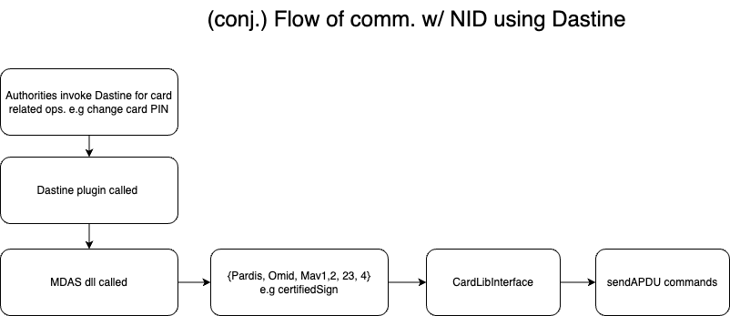

## Flow

## Glossary

- SOD: Document Security Object (SOD)
- MOC: Match on Card
- Antiyes
- CVCA: Country Verifying Certificate Authority
- SK: secret key
- PACE: Password Authenticated Connection Establishment
- DV: Document Verifier